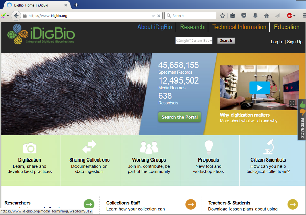
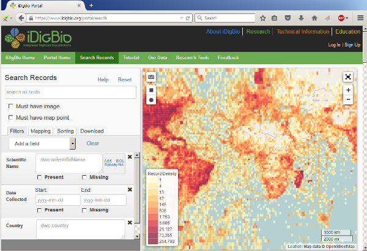

> ## Learning Objectives
>
> * Introduce species occurrence data
> * Introduce iDigBio
> * Describe what the lesson's work will result in

The purpose for this lesson is to download species occurence data from iDigBio
and prepare it for use with LifeMapper for species distribution modeling (SDM). 

## Species Occurrence Data

An "occurrence" of a species in biodiversity informatics refers to a provable
time and place where a plant or animal occured. Biologists are choosy about what
they accept as proof. Usually they require that the plant or animal is collected
and turned in to a museum specimen to document it.

Species occurence data is used in SDM to indicate where a species is known to
be. This is one of the inputs to the model. The data has to be georeferenced
(latitude and longitude) and identified (species name) but that is all that
LifeMapper requires. There are many other fields of data availible but we'll be
discarding them.

At the end of this lesson, we will have a file that can be used directly with
LifeMapper for modeling.

## iDigBio

iDigBio is a United States project to digitize all the museum specimens in the 
US. Since we are digitizing specimens, iDigBio contains nothing but occurrences
of species. This is ideal for using with LifeMapper. (Other data aggregators,
like GBIF, may accept non-occurrence data.)

## iDigBio Portal
iDigBio provides a data portal for searching for specimen records and media 
records using a map and web forms. You can download data by manually searching
for the records you want and then clicking the download button.

## iDigBio API

But, there are better ways! iDigBio has a web API availible that can be used to
download data automatically from a given query. The API uses JSON as input and
returns JSON.

The [APIs lesson](apis.html) in this workshop has examples of using the API
directly from a web browser. Endpoints, query formats, and returned data are 
documented in the [API source code wiki](https://github.com/iDigBio/idigbio-search-api/wiki)
on Github. At the end of this lesson we will return to this documentation.

It turns out, there is an even easier way to interact with the iDigBio API than
through a web browser: the [ridigbio](https://github.com/iDigBio/ridigbio)
package.

