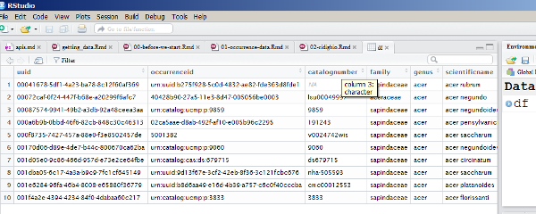

> ## Learning Objectives
>
> * Know what an R package is and how to install one
> * Install and load the ridigbio package
> * Retrieve occurrence data with ridigbio
> * Manually clean data
> * Write a CSV file from a data.frame

## R Packages

Packages in R are basically sets of additional functions that let you do more stuff in R. The functions we've been using, like str(), come built into R; packages give you access to more functions. You need to install a package and then load it to be able to use it.

You might get asked to choose a CRAN mirror - this is basically asking you to choose a site to download the package from. The choice doesn't matter too much; We recommend the RStudio mirror.

You only need to install a package once per computer, but you need to load it every time you open a new R session and want to use that package. The best place to
load the package is at the top of your R script file.

### Installing ridigbio

You may already have the ridigbio package installed. In case you do not, you can
do so using the R Studio interface.

1. In the lower right area, click on the Packages tab to make it active
1. Click the Install button in the tab
1. Type the name of the packages you want to install on the Packages line,
"ridigbio" (with no quotes) in this case
1. Check the Install Dependancies checkbox
1. Click Install 

RStudio will go out to the internet, download the packages from the mirror you 
selected, and install them for you.

If everything worked properly, then the following R code should run without 
errors:

```{r, results='show', purl=FALSE}
library(ridigbio)
```

## Downloading Data with ridigbio

Let's get started fetching data! Ok, not so fast. Ridigbio and the API get data
over the internet so if everyone tries to run large queries, we will run out of
bandwidth. The first thing we are going to learn how to do when searching with
the ridigbio package is limit the number of results returned.

The main function in the ridigbio package for searching records is called
`idig_search_records()`

Let's try a simple example:

```{r, eval=FALSE, purl=FALSE}
idig_search_records(limit=10, rq=list(genus="acer"))
```

Did a lot of stuff that looked like data go scrolling by on the screen?

Let's change that example to save it to a variable:

```{r, eval=FALSE, purl=FALSE}
df <- idig_search_records(limit=10, rq=list(genus="acer"))
```

### What's a data.frame?

`data.frame` is the main data structure for most tabular data and what we
use for statistics and plotting.

A `data.frame` is a collection of vectors of identical lengths. Each vector
represents a column, and each vector can be of a different data type (e.g.,
characters, integers, factors). The `str()` function is useful to inspect the
data types of the columns.

If you're not familiar with some of the words in that definition, you can think
of a dataframe as a well formatted table of data.

A `data.frame` is what the `idig_search_records()` function returns to you. We 
saved that `data.frame` to a variable called `df`. RStudio includes a variable
viewer that will let you look at the values of variables in a pretty format. To
look at the `df` variable, click on the variable name in the Environment tab in
the upper right section of RStudio. It should open a tab in the script area that
looks like this:



`data.frame`s are wonderful, complex, and powerful data structures. We are going
to see only a tiny part of what they are capable of today.

## Cleaning Data

You can see that some records have NA in some of the columns. You may even see
that some of the data in some columns looks wrong. An important part of 
downloading data from other sources is to inspect it and clean it of errors and
of data that does not meet your requirements. No data provider is perfect so
cleaning data is normal and everyone does it. 

### Selecting only Specific Columns

As a first step, let's get rid of columns that we do not need. Remember that 
LifeMapper only needs the scientific name, longitude, and latitude. Let's create
a new `data.frame` that has only those columns.

To do that, we will use an operation called indexing. We will use syntax with
the name of the dataframe that specifies the column names that we would like
as a vector and R will take only those columns from the data.frame and return
a new data frame to us. That syntax uses square brackets to surround the vector
and the `c()` function to create a vector of column names:

```{r, eval=FALSE, purl=FALSE}
df_small <- df[,
  c("scientificname", "geopoint.lon", "geopoint.lat")
  ]
```

The whole command has been split in to three lines so it is easier to read. You
will need to run all three lines together.

Notice the `,` (comma) at the end of the first line? We'll talk more about that
in a second.

Examine the `df_small` data.frame. Is it what you expected? Do you notice 
anything about the order of the records?

### Selecting only specific Rows

We have removed the extra columns but we still have rows with data that does not
look good.

#### Remove no Identification

Depending on what data is in iDigBio today, there might be records that have not
been identified to the species level. Let us remove those records because in 
LifeMapper, we are trying to model a specific species and not just undentified
specimens.

To select rows from a data.frame, we will use indexing again. This time however
we will provide a vector containing `TRUE` and `FALSE` values for each row in the
dataframe. R will return to us a new data.frame that contains only the rows 
that correspond to a `TRUE` in the vector.

How do we make such a vector? We can do so by selecting a column from the
dataframe and using the `is.na()` function to look for NA values:

```{r, eval=FALSE, purl=FALSE}
is.na(df_small$scientificname)
```

The `$` syntax is a short way of writing `df_small[c("scientificname")]`. If you
only want to refer to one column in a dataframe, you can just separate the 
data.frame name from the column name with a `$` (dollar sign).

That was a vector of mostly `FALSE` values, right? We want to select rows where
there is.na() is `FALSE` so we need to flip them to `TRUE`. We can do that with
the `!` (exclamaition point) symbol. So put it together:

```{r, eval=FALSE, purl=FALSE}
df_clean <- df_small[
  !is.na(df_small$scientificname),
  ]
```

Notice the comma at the end of the second line this time? Remember we would talk
about commas?

It turns out that the `[]` syntax takes two things: the rows you want and the
columns you want. You can leave either blank to mean "all" but you need to
include the comma so R knows which is which. We could also do both the row and
column selection at the same time:

```{r, eval=FALSE, purl=FALSE}
df_clean <- df[
  !is.na(df_small$scientificname),
  c("scientificname", "geopoint.lon", "geopoint.lat")
  ]
```

We didn't need the `df_small` variable in this case. We just indexed in to `df`
and took only the things we wanted.

Does `df_clean` look like you expect?

#### Remove no Georeference

It still looks like there is missing data in the longitude and latitude columns.
We can remove that data by changing the `TRUE` / `FALSE' vector we used as an
index to consider more than one row. We can combine the criteria with the `&` 
(ampersand) symbol which means "and". (The `|` (pipe) symbol means "or".)

```{r, eval=FALSE, purl=FALSE}
df_clean <- df[
  !is.na(df_small$scientificname) &
  !is.na(df_small$geopoint.lon) &
  !is.na(df_small$geopoint.lat),
  c("scientificname", "geopoint.lon", "geopoint.lat")
  ]
```

Now how many rows does `df_clean` have? Is that what you expect?

If you have a lot of data to clean, a good package to learn about is `dplyr`.
The official Data Carpentry lessons use this to do data cleaning. With it you 
can calucluate new columns, remove data, and even join data from different 
sources together.

## Saving a DataFrame as a CSV

We have downloaded data from iDigBio and cleaned it but it still all lives in a
variable in RStudio. LifeMapper needs it in a CSV file.

Fotunately, data.frames are easy to write out:

```{r, eval=FALSE, purl=FALSE}
write.csv(df_clean, "data/acer_cleaned.csv")
```

If you look in your data directory, you should now see a new file.

