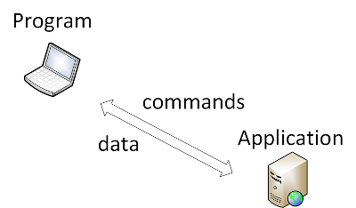
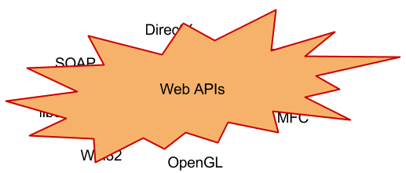
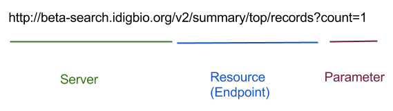

# Introduction to Web APIs

This presentation will introduce you to web APIs. Some limited prior 
programming knowledge is assumed: you should know what a function and variables 
are. There are a few lines of sample R code at the end but a general knowlege 
of programming languages will probably let you understand them.

## Goals

1. Learn the basic mechanics of a web API
1. Compose test calls to a web API
1. Be able to read web API documentation

---

## What is an API?

**API**: Application Programming Interface

* I am writing a *Program*
* and I want to use parts of someone else's *Application*
* and I need an *Interface* that describes the commands and data to do it.



So an API is an interface that describes how you can use someone else's 
application from within your program.

We talk about API's exposing functionality, being open, and enabling 
interaction. Remember that an API is a description of how to tell another 
application to do things for you and exchange data with you, programatically. 
While a web site or an application might let you give commands and get data 
using a graphical interface, the key distiction of an API and what let's us use 
words like "expose" and "enable" is the programatic part.

---

# Types of APIs

There are many types of APIs


But the coolest are Web APIs



Remember, an API is an *Interface* for your program to use. So what does that 
make a web API?

**Web API**: Web Interface for Programming

---

# A little about how the web works

It helps to understand a bit about how the web works in order to understand web 
APIs. Web APIs use the protocol of the web, hyper-text transfer protocol 
(HTTP), to move commands and data from your program to a server somewhere and 
back.

**HTTP**: Hyper-text Transfer Protocol

(Read *protocol* as "send this, get that".)

HTTP is easy:

1. Make a request of a server (text)
1. Maybe send some data with your request (more text)
1. Get text back

It is all specially formatted text (this is a lie, you can exchange binary 
information too but we're not going to talk about that today), so we can just 
look at it all and intuit what it means:

```

mcollins@mjc:~$ telnet www.textfiles.com 80
Trying 208.86.224.90...
Connected to www.textfiles.com.
Escape character is '^]'.
GET /underconstruction/ HTTP/1.1
host: www.textfiles.com

HTTP/1.1 200 OK
Date: Mon, 09 Mar 2015 21:42:13 GMT
Server: Apache/2.4.10 (FreeBSD)
Last-Modified: Mon, 12 Oct 2009 21:08:20 GMT
ETag: "c0f0-475c354493900"
Accept-Ranges: bytes
Content-Length: 49392
Content-Type: text/html

<html>
<title>Please be patient - This Page is Under Construction!</title>
<body bgcolor="#ffffff">
<center>
<h1>If you have any questions, comments, or suggestions, please <a 
href="mail">click here</a> to mail me.</h1>
This small collection was saved from the rapidly dying Geocities, which <a 
href="http://www.archiveteam.org">Archive Team</a> is working 
desperately to save for a historical archive. Please consider visit our site and 
helping us with collecting, education, and writing.
<p>


```

### Challenge

> How do you know what type of text you got back from the web server?

Remember our goal of being able to read documentation? In order to do that, we 
need to learn the terms that are used for some the different parts of the text 
that goes back and forth using HTTP.



<image highlighting parts of the HTTP transfer above>

So, to rephrase HTTP using web API terms:

1. Request a URL (Uniform Resource Locator) from a server made up of:
    1. Server name
    2. Resource name
    3. Parameters
1. Optionally send more text if the method allows it
1. Recieve headers and content

Don't worry about memorizing this now. Working with examples and reading 
documentation will help. Remember, we're just sending text and getting text back 
and your goal for understanding HTTP is to be able to understand web API 
documentation. You'll get help actually doing the requests later.

---

## Your first API call

Let's try making an API call to iDigBio's search API. Remember a web API is a 
web interface and we have an easy-to-use tool that is really good at web 
interfaces: your browser.

Type this into the address line of your favorite web browser:

    http://beta-search.idigbio.org/v2/summary/top/records

### Challenge

> What is the resource being requested?

You got back text but it's not HTML text so your browser doesn't know what to 
do with it. Instead, it just displays it. Does the text make any sense to you?

---

## Introducing JSON

Remember everything you get back is text but we want to use what we get back 
from the API in our programming language. Programing languages work with 
variables so how can we take variables and convert them to text and then back 
to variables again? That's where JSON comes in. (There are other formats but 
remember, we're only talking about the coolest things today and JSON is the 
coolest format.)

**JSON**: Javascript Object Notation

JSON is a *notation* for representing *objects* as text that can be directly 
executed in *Javascript* as code and will result in a data structure that can 
be assigned to a variable. Think ```data <- parse(JSON)``` in R.

Although this was originally made for Javascript, many other languages can 
interpret it. Again, you'll get help with the interpretation from your language 
later just like you'll get help with HTTP.

What can we denote? Objects and arrays. Here's the main part of the BNF-style 
description of the syntax of JSON:


http://json.org

It's not that scary. Take a look at the output from the API call we made 
earlier with a little formatting to make is easier to read:

```
{
    "scientificname": {
        "aleocharinae": {
            "itemCount": 52185
        },
        "hymenoptera": {
            "itemCount": 46094
        },
        "unidentified": {
            "itemCount": 45947
        },
        "peromyscus maniculatus": {
            "itemCount": 40158
        },
        "uta stansburiana": {
            "itemCount": 39658
        },
        "aphodius": {
            "itemCount": 34115
        },
        "curculionidae": {
            "itemCount": 33623
        },
        "diptera": {
            "itemCount": 33085
        },
        "plethodon cinereus": {
            "itemCount": 30916
        },
        "undetermined": {
            "itemCount": 30856
        }
    },
    "itemCount": 26047852
}
```

### Challenges

> How many specimen records in iDigBio have been identified as *Plethodon 
> cinereus*?

> How many total specimen records are there in iDigBio?

---

## Tying in documentation

Now that we know web APIs send HTTP requests and return JSON, let's look at 
some documentation to see if we can craft some API calls and interpret the 
results.

Here is the actual documentation for the API request we've been making:

---

### Top-N Records

```
GET, POST /v2/summary/top/records/
```

<table width="50%">
<tr>
    <td>Parameter</td>
    <td>Description</td>
</tr>
<tr>
    <td>rq</td>
    <td>Search Query in [iDigBio Query 
Format](https://github.com/iDigBio/idigbio-search-api/wiki/Query-Format), using 
[Record Query 
Fields](https://github.com/iDigBio/idigbio-search-api/wiki/Index-Fields#record-
query-fields)</td>
</tr>
<tr>
    <td>top_fields</td>
    <td>a list of fields to return, specified using the fieldName parameter 
    from [Fields](https://github.com/iDigBio/idigbio-search-api/wiki#fields) 
with type records</td>
</tr>
<tr>
    <td>count</count>
    <td>The number of top value to return</td>
</tr>
</table>

Returns a custom JSON format containing the top-N (where n is specified with 
count) values for a given field. When multiple fields are supplied, the values 
will be nested inside each-other. This allows you to build field heirarchies. 
For example:

```
/v2/summary/top/records/?fields=["kingdom","phylum"]&count=10
```

Will return the top 10 kingdoms for all records, and the top 10 phylums for each
kingdom.

---

### Challenge

> In your browser address bar, type in an API call to the top records end point 
> that returns the 3 most frequent species names in iDigBio. (Hint: species name
> is the default field.)

---

## JSON out, JSON in too

APIs return JSON but they can also take JSON as well. Look carefully at the 
example from above:

```
/v2/summary/top/records/?fields=["kingdom","phylum"]&count=10
```

The ```["kingdom","phylum"]``` is JSON that we're passing to the API to tell it 
the array of field names we want to use. 

### Challenge

> In your browser address bar, type in an API call that returns the most common 
> genus in the United States. (Hint: there are iDigBio fields called *genus* 
> and *country*.)

---

## What about my programming language?

All this HTTP and text is great but really what you want are functions and 
variables in your programming language. Writing a program is what you were 
originally trying to do.

This is where *packages* in R come in to play. (*Packages* are also called 
*libraries*.) Installing and configuring packages is another 
lesson and we'll spend another full session working with packages that use APIs 
in R shortly. As a start, consider this R code as your final challenge:

### Challenge

> Describe in English what this R code does:

     library("ridigbio")
     tops <- idig_top_records(top_fields=c("institutioncode", "genus"),
                              count=3)
     names(tops$institutioncode)

> Without using R, can you get the output yourself?

---
